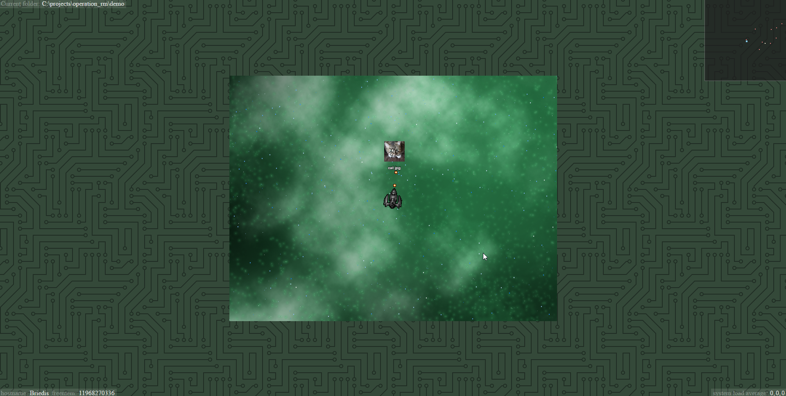

# Operation RM

_For decades, file operations have been handled by operating system kernels. These workhorses of modern society have silently prevented our civilization from regressing into anarchy. However, times have changed, and malware has nested itself deeply within our filesystems, preventing kernels from doing their job. Now it is **your** duty to recursively remove all files from your PC, and prevent a global apocalypse of epic proportions. Welcome to **Operation RM**, operator._

Operation RM is a game in which you explore your filesystem in order to destroy files.

(Note: Operation RM does not actually make any modifications to your filesystem ([yet?](https://github.com/jorisvddonk/operation_rm/issues/1)))

## Goal of the game

The goal of the game is simple: remove as many files as possible by destroying them!

## Controls

`Arrow keys` or `W/A/S/D` to move your spaceship around. `Space` to shoot.

## Cool features

* Explore your filesystem! Destroy files!
* Videos are automatically transcoded by the backend server and streamed to the client. Transcoded videos are not stored on disk. Note, though, that navigating through folders with many videos in them [may currently cause performance issues](https://github.com/jorisvddonk/operation_rm/issues/3).
* Images are automatically resized and sent to the client.

## Current status and future development

Currently, the main game loop is rather barebones, and there is no clear winning or losing state. See the [list of issues](https://github.com/jorisvddonk/operation_rm/issues) for potential future enhancements.

## System architecture

See [these docs](docs/system_architecture.md) for more info.

# Running & developing the game

First, ensure you have the following requirements installed:

* NodeJS v7.x.x
* (optional) ffmpeg with support for encoding oggvorbis video. The ffmpeg binary needs to be in your `PATH`. Alternatively, you can set the `FFMPEG_PATH` environment variable to the absolute path to the ffmpeg binary. If you haven't installed ffmpeg, you won't get to see videos being rendered in game!

Once you have the requirements installed, this will get the game running for you:

1. Install all JavaScript library dependencies: `npm install`
2. Compile the client code: `npm run-script webpack`
3. Run the backend server: `npm start`
4. Play the game via http://localhost:8099/

To develop the project, run webpack in 'watch' mode with `npm run-script webpack -- --watch`

# Known Working Configuration

This game was developed and tested on the following system configuration:

* Windows 10 (Creators Update)
* NodeJS v7.1.0 (64-bit)
* Chrome 58.0.3029.110 (64-bit)

Systems deviating from the above configuration may experience issues.

# Running with a different game root

By default, Operation RM is played from within the Operation RM directory, and you can't escape it ingame.
To change the game's "root" folder so that you can explore your entire filesystem, use the --root command line parameter, e.g. `npm start -- --root=C:\\` or `npm start -- --root=/`